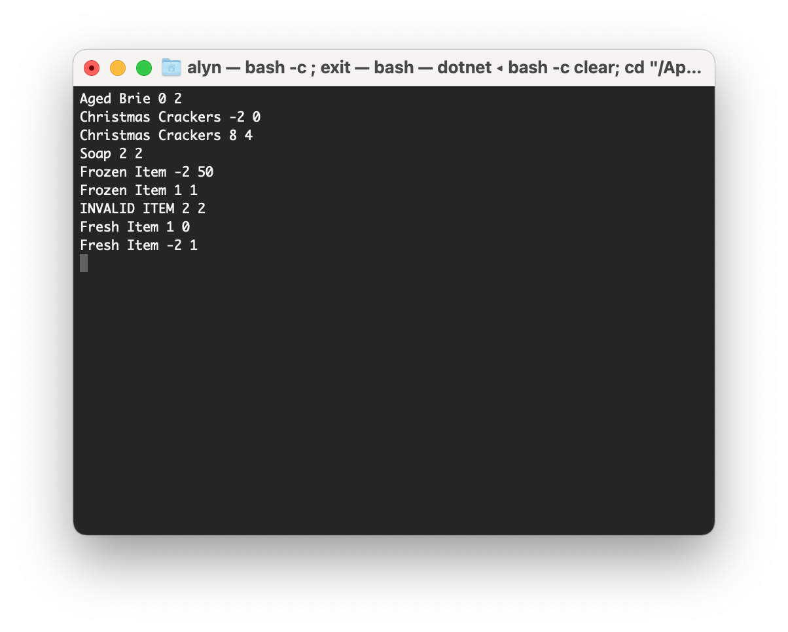

# IcelandInventoryTechTest

> We are a small convenience store with a prime location in a prominent city ran by a friendly shopkeeper named Alison. We also buy and sell only the finest goods. Unfortunately, our goods are constantly degrading in quality as they approach their sell by date. We currently update our inventory manually.
Your task is to write a program which automates the inventory management based on the following rules:

> Rules:
> - All items have a SellIn value which denotes the number of days we have to sell the item
> - All items have a Quality value which denotes how valuable the item is
>- At the end of each day our system lowers both values for every item
>- Once the sell by date has passed, Quality degrades twice as fast
>- The Quality of an item is never negative
>- The Quality of an item is never more than 50
>- "Aged Brie" increases in Quality the older it gets
>- “Frozen Item” decreases in Quality by 1
>- "Soap" never has to be sold or decreases in Quality
>- "Christmas Crackers", like “Aged Brie”, increases in Quality as its SellIn value approaches; Its
>quality increases by 2 when there are 10 days or less and by 3 when there are 5 days or less
>but quality drops to 0 after Christmas
>- "Fresh Item" degrade in Quality twice as fast as “Frozen Item”

>Input: A list of items in the current inventory. Each line in the input represents an inventory item with Item name, its sell-in value and quality e.g. “Christmas >Crackers -1 2” => Christmas Crackers are past sellin value by 1 day with quality 2.
>Output: Updated inventory after adjusting the quality and sellin days for each item after 1 day.

>|Test Input :|Expected Output :|
>|------------|-----------------|
>|Aged Brie 1 1|Aged Brie 0 2|
>|Christmas Crackers -1 2|Christmas Crackers -2 0|
>|Christmas Crackers 9 2|Christmas Crackers 8 4|
>|Soap 2 2|Soap 2 2|
>|Frozen Item -1 55|Frozen Item -2 50|
>|Frozen Item 2 2|Frozen Item 1 1|
>|INVALID ITEM 2 2|NO SUCH ITEM|
>|Fresh Item 2 2|Fresh Item 1 0|
>|Fresh Item -1 5|Fresh Item -2 1|

>Notes:
>You may use external libraries or tools for building or testing purposes e.g. (JUnit, NUnit, Xunit etc).
>You should NOT use any executables (e.g. bat, class, cmd, exe, jar, jsp msi etc) in your submission. As well as satisfying the rules provided your solution should >demonstrate how you would architect a
>solution to be maintainable, testable and in line with the SOLID principles.
>We need to be able to build and run your program, therefore, please submit your code on github as a public repository and provide us a link to clone your >repository. Your submission should contain the source code and clear instructions on how to build, test and run the program (preferably a Readme).

